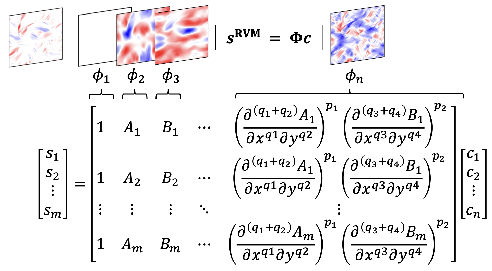

# Equation Discovery for 2D Turublence

> **Discover subgrid-scale (SGS) momentum flux closures for 2D turbulence (FHIT)**

[](https://arxiv.org/abs/2306.05014)

**Related solver:** [py2d - Python-JAX-based solver for 2D Turbulence](https://github.com/envfluids/py2d.git)

<div align="center">

</div>

## Table of Contents

- [Introduction](#introduction)
- [Installation](#installation)  
- [Requirements](#requirements)
- [Data](#data)
- [Usage](#usage)
- [Citation](#citation)
- [References](#references)

## Introduction

By combining AI and fluid physics, we discover a closed-form closure for 2D turbulence from small direct numerical simulation (DNS) data. Large-eddy simulation (LES) with this closure is accurate and stable, reproducing DNS statistics including those of extremes. We also show that the new closure could be derived from a 4th-order truncated Taylor expansion. Prior analytical and AI-based work only found the 2nd-order expansion, which led to unstable LES. The additional terms emerge only when inter-scale energy transfer is considered alongside standard reconstruction criterion in the sparse-equation discovery

## Installation

Clone this repository and install in development mode:

```bash
git clone https://github.com/jakharkaran/EqsDiscovery_2DTurbulence.git
cd EqsDiscovery_2DTurbulence
pip install -e ./
```

## Requirements

### Software Dependencies

- **MATLAB**: R2022a or higher
- **Python**: 3.11+

### Python Packages

```bash
pip install scipy numpy scikit-learn h5py
```
- [scipy](https://pypi.org/project/scipy/)
- [numpy](https://pypi.org/project/numpy/)
- [scikit-learn](https://pypi.org/project/scikit-learn/)
- [h5py](https://pypi.org/project/h5py/)

### Additional Libraries

- **RVM**: [rvm-find](https://github.com/TomBolton/rvm-find) (included in eqsdiscovery)

## Data

### Dataset Access

The complete dataset used in this work is publicly available:

**Zenodo Repository**: [](https://doi.org/10.5281/zenodo.17173020)

### Data Structure

The dataset includes:
- **Training Data**: `train.mat` (100 snapshots)
- **Testing Data**: `test.mat` (20 snapshots)
- **Variables**: Vorticity (Omega) with shape [Time, Y, X]


## Citation

If you use this code or data in your research, please cite:

### Primary Publications

```bibtex
@article{jakhar2025analytical,
  title={An Analytical and AI-discovered Stable, Accurate, and Generalizable Subgrid-scale Closure for Geophysical Turbulence},
  author={Jakhar, Karan and Guan, Yifei and Hassanzadeh, Pedram},
  journal={arXiv preprint arXiv:2509.20365},
  year={2025}
}
```

```bibtex
@article{jakhar2024learning,
  title={Learning closed-form equations for subgrid-scale closures from high-fidelity data: Promises and challenges},
  author={Jakhar, Karan and Guan, Yifei and Mojgani, Rambod and Chattopadhyay, Ashesh and Hassanzadeh, Pedram},
  journal={Journal of Advances in Modeling Earth Systems},
  volume={16},
  number={7},
  pages={e2023MS003874},
  year={2024},
  publisher={Wiley Online Library},
  doi={10.1029/2023MS003874}
}
```

## References

### Dependencies

This work builds upon the following open-source libraries:

**RVM-Find Library:**
```bibtex
@article{Zanna_GRL_2020,
  author = {Zanna, Laure and Bolton, Thomas},
  title = {Data-Driven Equation Discovery of Ocean Mesoscale Closures},
  journal = {Geophysical Research Letters},
  volume = {47},
  number = {17},
  pages = {1--13},
  year = {2020},
  doi = {10.1029/2020GL088376}
}
```

---

## Authors

- **Karan Jakhar** - [Google Scholar](https://scholar.google.com/citations?user=buVddBgAAAAJ&hl=en)
- **Yifei Guan** - [Website](https://gyf135.github.io/)
- **Pedram Hassanzadeh** - [Google Scholar](https://scholar.google.com/citations?user=o3_eO6EAAAAJ&hl=en)